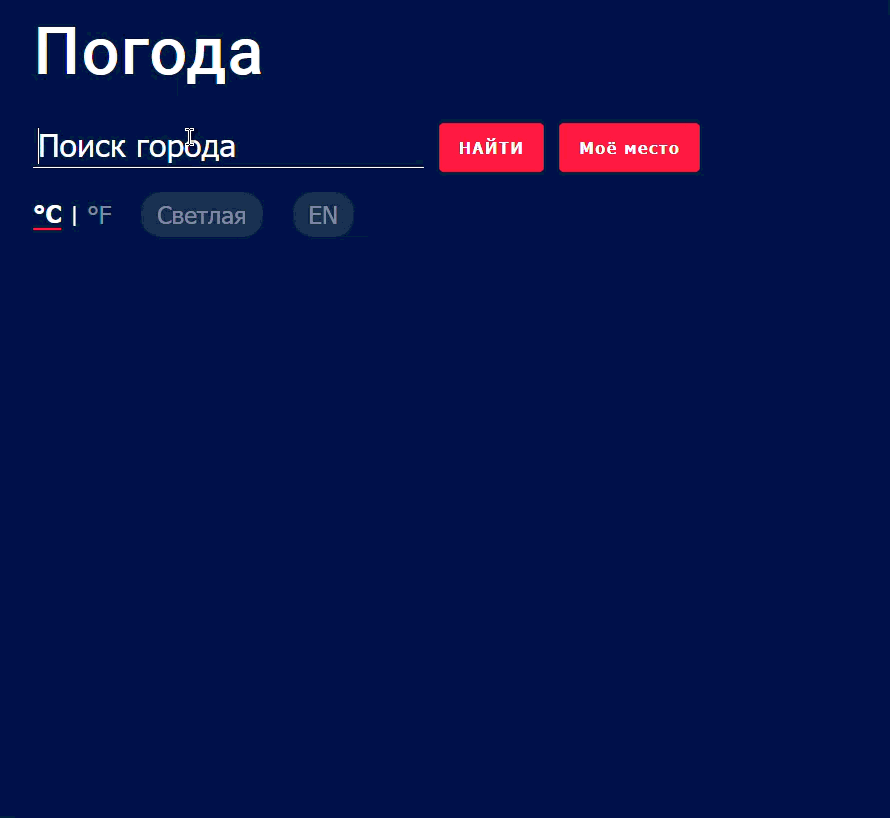

# Weather App

Простое приложение для просмотра погоды в любом городе мира, построенное на React.


## Ссылки

- **Демо:** _ссылка на Vercel (https://weather-app-mu-three-75.vercel.app/)_
- **Туториал:** [Build a Simple Weather App With Vanilla JavaScript](https://webdesign.tutsplus.com/build-a-simple-weather-app-with-vanilla-javascript--cms-33893t)
- **API:** [OpenWeatherMap](https://openweathermap.org/)

## Функциональность

- Поиск погоды по названию города
- Определение погоды по геолокации
- Переключение между °C и °F
- Удаление карточки города
- Отображение влажности, скорости ветра и давления
- Тёмная / светлая тема
- Переключение языка (RU / EN)
- Анимация появления карточек
- Адаптивный дизайн

## Стек технологий

- **React** (Vite)
- **OpenWeatherMap API**
- **CSS Modules**

## Установка и запуск

```bash
# Клонировать репозиторий
git clone https://github.com/ROCKKKKK7/WeatherApp.git

# Перейти в папку
cd WeatherApp

# Установить зависимости
npm install

# Запустить проект
npm run dev
```

## API ключ

Проект использует [OpenWeatherMap API](https://openweathermap.org/api). API ключ уже встроен в проект для удобства проверки.

## Структура проекта

```
src/
├── App.jsx                 # Главный компонент
├── App.module.css          # Стили
├── mapingicon.js           # Маппинг иконок погоды
├── weatherTranslations.js  # Переводы описаний погоды
├── translations.js         # Переводы интерфейса
└── assets/                 # Иконки погоды (SVG)
```
